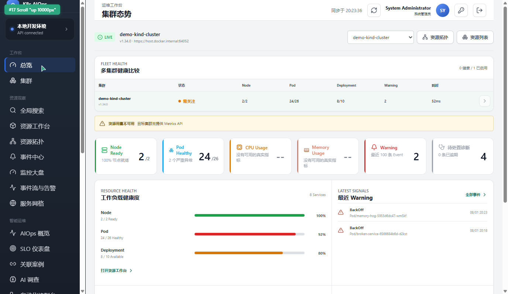
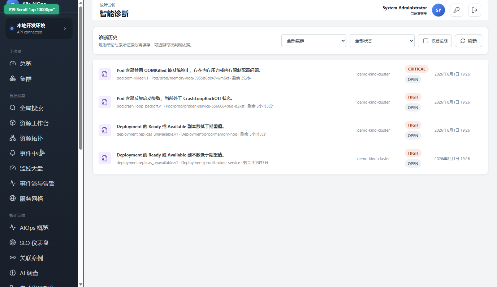

<div align="center">

# 归一 · Guiyi Labs

**Kubernetes · DevOps · AIOps Engineering**

<p>
<em>让复杂系统归一：可观测、可诊断、可控制。</em><br />
Converging complex systems into reliable operations.
</p>

[](https://github.com/guiyi-labs)
[](https://github.com/guiyi-labs?tab=followers)
[](https://github.com/guiyi-labs)
[](https://github.com/guiyi-labs?tab=repositories)

</div>

---

## 旗舰项目 / Flagship Project

### [](https://github.com/guiyi-labs/aiops-platform)

<div align="center">


-success?style=flat-square)


</div>

面向中小规模 Kubernetes 环境的**多集群可观测、证据型故障诊断与受控运维平台**。从 M1 到 M60，历经 60 个里程碑的迭代，覆盖多集群管理、故障诊断、受控运维、GitOps 交付、供应链安全与 AI 辅助分析的完整能力链路。

<div align="center">

<a href="https://github.com/guiyi-labs/aiops-platform"></a>

<sub>总览控制台 · 多集群资源编排、实时事件流与故障诊断概览</sub>

</div>

<details>
<summary><b>智能诊断 · 真实案例截图 / Diagnosis — Real Cases</b></summary>

<div align="center">

<a href="https://github.com/guiyi-labs/aiops-platform"></a>

<sub>智能诊断 · 证据型根因分析 — OOMKilled / CrashLoopBackOff / Deployment 副本不可用等真实故障案例，含严重等级、剩余时间与根因规则</sub>

</div>

</details>

<details>
<summary><b>核心能力一览 / Core Capabilities</b></summary>

| 领域 | 能力 | 工程方法 |
| :-- | :-- | :-- |
| 多集群管理 | 集群注册、健康探测、命名空间工作台、CRD 浏览 | 有界并发、超时控制、采样限制、部分失败上报 |
| 可观测性 | 监控大盘、事件流、告警路由与抑制、Prometheus 指标 | Kubernetes Metrics API、有界事件流（非 Watch） |
| 故障诊断 | 证据型诊断、规则引擎、资源快照、根因分析 | 确定性规则保留快照/事件/链路证据，AI 解释不越权 |
| 受控运维 | 预览、类型化 Diff、确认、幂等执行、审计 | Dry-run → Preview → Confirm → Execute → Audit 全链路 |
| 巡检与服务网格 | 8 类内置巡检规则、VirtualService/DestinationRule 只读 | 编译期规则、进程内 Cron、只读 Istio 资源 |
| 交付与安全 | Helm 目录、Flux HelmRelease、ArgoCD GitOps、Cosign 签名 | SLSA v1 供应链、SHA-256 校验、版本化 OCI 归档 |
| 平台扩展 | 静态扩展框架、10 个内置 Provider、拓扑排序生命周期 | 编译期注册、健康探测、集群角色过滤 |

</details>

<details>
<summary><b>里程碑路线图 / Milestone Roadmap (M1–M60)</b></summary>

| 阶段 | 里程碑 | 交付内容 |
| :-- | :-- | :-- |
| Phase 0 — 基座 | M1–M14 | 后端骨架、认证授权（OIDC/RBAC/2D 矩阵）、多集群接入、Kind E2E |
| Phase 1 — 控制台 | M15–M20 | Vue 3 前端、KubeSphere 风格三层导航、受控操作框架（M19） |
| Phase 2 — 可观测 | M21–M25 | Metrics 采集、告警引擎、审计日志、PITR 备份恢复 |
| Phase 3 — 诊断 | M26–M33 | 证据型诊断、规则引擎、快照归档、故障注入与回归 |
| Phase 4 — 扩展 | M34–M45 | CRD 发现与浏览、跨集群复制、DevOps 流水线、备份还原 GUI |
| Phase 5 — 平台化 | M46–M60 | 三层控制台、监控大盘、巡检/网格、Helm/GitOps、供应链安全、扩展框架 |
| Post-M45 | M61–M63 | 分析器 API 优化、性能调优 |
| Phase 6 — 规划中 | M64+ | 多集群联邦、混沌工程、AI 诊断增强 |

</details>

---

## 我们在做什么 / What We Build

我们专注于 Kubernetes、DevOps、AIOps 与自动化工程实践，构建**可运行、可验证、可交付**的系统，而不是停留在概念演示。

| 方向 | 实践 |
| :-- | :-- |
| **云原生运维** | 多集群管理、资源工作台、可观测性与故障诊断 |
| **受控自动化** | 任务编排、确定性规则、权限校验、确认、幂等与审计 |
| **可信 AI 工程** | RAG、知识图谱、可解释降级，AI 增强但不越权 |
| **可复现交付** | 容器化部署、真实集群验证、自动化测试与版本化归档 |

---

## 项目矩阵 / Project Portfolio

| Project | Description | Stack | Status |
| :-- | :-- | :-- | :-- |
| [aiops-platform](https://github.com/guiyi-labs/aiops-platform) | Kubernetes 多集群可观测、诊断与受控运维平台 | Go · Vue · TypeScript · PostgreSQL |  |
| [XHZhishu](https://github.com/guiyi-labs/XHZhishu) | 可信 RAG、知识图谱与科研计算一体化平台 | Python · Vue · PostgreSQL · Neo4j | Active |
| [netcheck-platform](https://github.com/guiyi-labs/netcheck-platform) | 网络自动化巡检、故障诊断、报告与告警平台 | Python · FastAPI · JavaScript · Docker | Active |
| [devops-automation](https://github.com/guiyi-labs/devops-automation) | 任务编排、资产管理、监控与 Kubernetes 部署 | Python · FastAPI · Vue · Redis | Active |
| [kubernetes-cluster-bootstrap](https://github.com/guiyi-labs/kubernetes-cluster-bootstrap) | kubeadm 单节点、高可用与 Ansible 自动部署实践 | Kubernetes · kubeadm · Ansible · Linux | Stable |

---

## 技术栈 / Technology Stack

<p align="center">
  
</p>

| Area | Technologies |
| :-- | :-- |
| Cloud Native | Kubernetes, client-go, kubeadm, kind, Kustomize, Docker Compose |
| Backend & Data | Go, Python, FastAPI, PostgreSQL, pgvector, Redis, Neo4j |
| Frontend | Vue 3, TypeScript, Vite, Pinia, Lucide |
| Observability | Kubernetes Metrics API, Prometheus, Grafana, structured audit events |
| Delivery | GitHub Actions, automated tests, real-cluster E2E, OCI archives, Cosign, SLSA |

---

## 工程原则 / Engineering Principles

```
Deterministic core          AI-assisted explanation
Least privilege             Explicit capability boundaries
Preview and confirmation    Idempotent execution
Real environment tests      Retained delivery evidence
```

- **确定性优先**：先建立确定、可复现的主链路，再引入 AI 增强能力。
- **受控变更**：高风险操作必须经过权限校验、预览、确认、幂等执行和审计。
- **证据驱动**：用自动化测试、真实环境验证和归档证据支撑交付结论。
- **AI 辅助不越权**：AI 可以解释与辅助决策，但不直接获得不受限制的变更权限。

---

## 当前重点 / Current Focus

- **平台成熟度**：aiops-platform 已完成 M1–M60 全部里程碑，进入稳定维护与社区化阶段。
- **多集群联邦**：Host/Member 集群模型，跨集群资源同步与全局调度。
- **AI 诊断增强**：基于 RAG 的故障知识库与可解释的根因推荐。
- **供应链安全**：Cosign 密钥签名、SLSA v1 Provenance、可验证的构建归档。
- **可信 RAG 与科研工作流**：GraphRAG、垂直领域知识图谱与可审计的科研计算。

---

## GitHub Activity

<p align="center">
  <a href="https://github.com/guiyi-labs">
    
  </a>
  <a href="https://github.com/guiyi-labs">
    
  </a>
</p>

<p align="center">
  
</p>

---

<div align="center">

**Reproducibility · Observability · Controlled Delivery**

<sub>Built with Go · Vue · Kubernetes — Verified with real kind clusters — Secured with Cosign & SLSA</sub>

</div>
