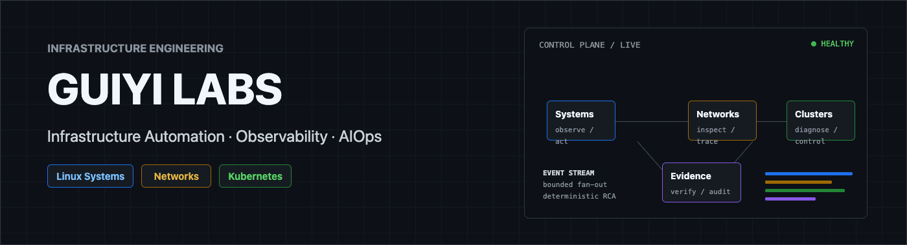

  

  <strong>Converging complex infrastructure into reliable operations.</strong> 
  Linux &middot; Network Automation &middot; Kubernetes &middot; Observability &middot; AIOps

  
  
  
  
  
  
   
  
  
  
  
  
  

  <a href="https://github.com/guiyi-labs/aiops-platform">Flagship Project</a> &middot;
  <a href="https://github.com/guiyi-labs/aiops-platform/releases">Releases</a> &middot;
  <a href="https://github.com/guiyi-labs/aiops-platform/blob/main/docs/README.md">Engineering Docs</a>

  
  

---

## Infrastructure, end to end

围绕系统、网络与 Kubernetes 三层基础设施，构建可观测、可诊断、可控制、可复现的运维工程系统。

| Layer | Project | What it does |
|---|---|---|
| 🖥️ **Systems** | [devops-automation](https://github.com/guiyi-labs/devops-automation) | 主机资产、受控批量任务、部署回滚、MySQL 备份恢复、监控告警 |
| 🌐 **Networks** | [netcheck-platform](https://github.com/guiyi-labs/netcheck-platform) | SNMPv3/SSH 采集、配置备份与差异、巡检诊断、告警报告 |
| ☸️ **Clusters** | [aiops-platform](https://github.com/guiyi-labs/aiops-platform) | Kubernetes 多集群可观测、证据型诊断、受控运维、SLO |
| ⚙️ **Provisioning** | [kubernetes-cluster-bootstrap](https://github.com/guiyi-labs/kubernetes-cluster-bootstrap) | kubeadm + Ansible 双架构集群交付与 Day2 运维 |

---

## Flagship &middot; Kubernetes Multi-Cluster AIOps Platform

  

面向中小规模 Kubernetes 环境的多集群可观测、证据型故障诊断与受控运维平台。

- **Evidence-first diagnosis**：确定性规则保留资源状态、事件与引用证据，AI 仅作可选解释增强。
- **Controlled operations**：高风险动作统一经过权限校验、dry-run、确认、幂等执行与审计。
- **Multi-cluster isolation**：有界并发、故障隔离，以及 Cluster + Namespace 粒度授权。
- **Reproducible delivery**：真实 kind E2E、OpenAPI 契约、CI 门禁、SBOM、签名与版本化归档。

> **Observe &rarr; Diagnose &rarr; Explain &rarr; Preview &rarr; Confirm &rarr; Execute &rarr; Audit**

  
<strong>View diagnosis evidence interface</strong>

   
  

---

## Verified results

| Project | Verification |
|---|---|
| **aiops-platform** | 后端平均覆盖率 **~74%**（门禁 ≥65%）；真实 kind 集群 E2E；OpenAPI contract 与 SBOM 门禁 |
| **netcheck-platform** | **257** tests passed；真实 SNMPv3/SSH/LLDP 容器验收（WALK 证据） |
| **devops-automation** | **121+** tests；双真实 Ubuntu VM SSH 验收（host-key / 凭据 / sudo 拒绝） |
| **kubernetes-cluster-bootstrap** | 双架构（arm64 + x86_64）真实部署 &rarr; 验收 &rarr; 幂等 &rarr; reset 闭环 |

---

## Applied AI systems

- [**XHZhishu**](https://github.com/guiyi-labs/XHZhishu) — 可信 RAG、知识图谱与科研计算工作流
- [**zhijingtong**](https://github.com/guiyi-labs/zhijingtong) — 面向低资源服务器的轻量 RAG 工作台

---

## Engineering principles

- **Deterministic core** — AI-assisted explanation only
- **Least privilege** — Explicit capability boundaries
- **Preview and confirmation** — Idempotent execution
- **Real environment tests** — Retained delivery evidence

  Reproducibility &middot; Observability &middot; Controlled Delivery

